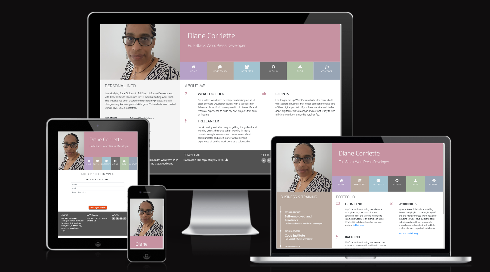

## Live Website

Live deployed project link is [Diane Corriette Portfolio](https://todiane.github.io/ucd-resume/)

This is the Code Institute student template for UCD Resume. Created on 21 August 2023.  

The training takes us through how to create a resume website using html, css and Bootstrap 4.6.

I updated my website to showcase my own experience and training plus provide links to my portfolio projects and social media.

## My Other Projects

Use Ctrl (Cmd) and mouse click to open them in a new window.

Project 1 - HTML and CSS - [Sologamy](https://todiane.github.io/sologamyp1/)

Project 2 - JavaScript   - [Cycle of Life](https://todiane.github.io/cycle-of-life-p2/)

Project 3 - Python       - [Corri Construction](https://corri-construction-8c4725a33281.herokuapp.com/)
---

Happy coding!
